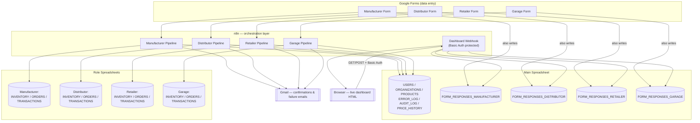

# Architecture & Step-by-Step Explanation

## 1. High-level architecture

## 2. Why four separate pipelines instead of one shared one

Each role's intake (Manufacturer / Distributor / Retailer / Garage) is a fully
independent copy of the same 19-node validation → order → inventory → transaction →
email chain, prefixed with its role name (e.g. `Distributor - Validate Seller`).
They're functionally identical, just isolated, so a change or bug in one role's flow
can never affect another's, and the canvas stays readable per-role.

## 3. Per-role pipeline — step by step

1. **`{Role} Form`** — Google Form trigger receiving the raw submission (this also
   writes a row to that role's `FORM_RESPONSES_{ROLE}` tab automatically, since
   that's how linked Google Forms work).
2. **`{Role} Form Map`** — normalizes field names into a consistent shape:
   `User_Email`, `From_Organization`, `To_Organization`, `Transaction_Type`,
   `Product`, `Quantity`, `Required_Date`, `Priority`, `Remarks`.
3. **`{Role} - Form Fields`** → **`Config`** → **`Role Sheets`** — load the main
   spreadsheet ID and all four role spreadsheet IDs.
4. **`{Role} - Spreadsheet ID Set?`** — safety check; falls back to
   `Prepare Seed Data` if sheet IDs are missing.
5. **`{Role} - Validate User`** — looks up the submitter's email in `USERS`.
6. **`{Role} - Validate Seller`** / **`Validate Buyer`** — confirm the From/To
   organizations exist in `ORGANIZATIONS` and get their `Type`, which determines
   which role sheet holds their inventory.
7. **`{Role} - Validate Product`** — looks up the product in `PRODUCTS`.
8. **`{Role} - Get Seller Inventory`** / **`Get Buyer Inventory`** — pull current
   stock from the correct role sheet.
9. **`{Role} - Normalize & Validate`** (Code node) — generates a `Request_ID`,
   checks stock availability, computes pricing/tax/total, builds `order`/`txn`/
   `error` objects, sets `valid: true/false`.
10. **`{Role} - Valid?`** branches:
    - **True →** `Create Order` → `Update Seller Inventory` → `Update Buyer Inventory`
      → `Create Transaction` → `Update Order Status` → `Send Success Email`.
    - **False →** `Log Error` (writes to `ERROR_LOG`) → `Send Failure Email`.

## 4. Dashboard webhook — step by step

1. **`Dashboard Webhook`** (`n8n-nodes-base.webhook`, path
   `supply-chain-dashboard`, **Basic Auth** required) — the entry point. Someone
   visits `https://<your-n8n-domain>/webhook/supply-chain-dashboard` and is
   prompted for a username/password before anything runs.
2. **`Get Manufacturer Responses`** → **`Get Distributor Responses`** →
   **`Get Retailer Responses`** → **`Get Garage Responses`** — read each role's raw
   `FORM_RESPONSES_*` sheet, in sequence.
3. **`Build Dashboard Page`** (Code node) — tags every row with its role, merges
   all four sets, computes: total responses, per-role counts, and the 15 most
   recent submissions across all roles (in reverse-chronological order). Renders it
   all into one self-contained HTML page.
4. **`Respond Dashboard`** (Respond to Webhook) — returns that HTML directly with
   `Content-Type: text/html`.

This reads the **raw form responses** — not the processed `ORDERS`/`TRANSACTIONS` —
so it reflects every submission the instant it's made, including ones still being
validated or that failed validation. It intentionally shows activity across all
roles rather than filtering to one user.

`index.html` / `style.css` / `script.js` in this package are a standalone,
framework-free reproduction of that same page for local preview or reuse outside
n8n — `n8n-code-node-source.js` is the authoritative source actually running inside
the workflow.

## 5. Data model

### Main spreadsheet

| Sheet | Purpose |
|---|---|
| `USERS` | Registered users and their email. |
| `ORGANIZATIONS` | Every organization, its ID, and its `Type`. |
| `PRODUCTS` | Product catalog. |
| `ERROR_LOG` | Every rejected request, with reason. |
| `AUDIT_LOG` | System-wide audit trail. |
| `PRICE_HISTORY` | Price changes over time. |
| `FORM_RESPONSES_MANUFACTURER` | Raw Manufacturer form submissions — read by the dashboard. |
| `FORM_RESPONSES_DISTRIBUTOR` | Raw Distributor form submissions — read by the dashboard. |
| `FORM_RESPONSES_RETAILER` | Raw Retailer form submissions — read by the dashboard. |
| `FORM_RESPONSES_GARAGE` | Raw Garage form submissions — read by the dashboard. |

### Each role spreadsheet (Manufacturer / Distributor / Retailer / Garage)

| Sheet | Purpose |
|---|---|
| `INVENTORY` | Current stock per organization + product. |
| `ORDERS` | Validated, processed orders where this role was the seller. |
| `TRANSACTIONS` | Immutable transaction ledger backing those orders. |

## 6. Setup order

1. Create the main spreadsheet and the four role spreadsheets; add all sheets listed
   above (including the four `FORM_RESPONSES_*` tabs).
2. Add Google Sheets OAuth2 and Gmail OAuth2 credentials in n8n.
3. Import the workflow JSON.
4. Update the hard-coded spreadsheet IDs in `Config` / `Role Sheets` /
   `Get {Role} Responses` nodes to match your own sheets.
5. Create the four Google Forms (Manufacturer, Distributor, Retailer, Garage); link
   each one's responses to its `FORM_RESPONSES_{ROLE}` sheet tab, and connect each
   to its matching n8n Form Trigger node.
6. In n8n, go to **Credentials → New → Basic Auth**, name it
   **"Dashboard Basic Auth"**, and set a username/password. Confirm the
   `Dashboard Webhook` node uses it.
7. Activate the workflow.
8. Submit a test order on each role's form and confirm: the order appears in the
   correct role sheet, inventory updates, a confirmation email arrives, and the row
   shows up in that role's `FORM_RESPONSES_*` tab.
9. Open `https://<your-n8n-domain>/webhook/supply-chain-dashboard`, enter the Basic
   Auth credentials, and confirm the test submissions appear.

## 7. Error handling

Every pipeline's `Valid?` false branch writes a row to `ERROR_LOG` with:
`Error_ID`, `Timestamp`, `Request_ID`, `User_Email`, `Error_Type`, `Error_Message`,
`From_Organization_ID`, `To_Organization_ID`, `Product_ID`, `Quantity`,
`Workflow_Name`, `Node_Name`, `Status`. The requester also gets a failure email
explaining what went wrong, so nothing fails silently.

## 8. Security notes

- The dashboard webhook requires **Basic Auth** — without valid credentials, the
  request never reaches the sheet-reading nodes.
- The dashboard shows raw form submissions across all four roles to anyone with
  valid credentials — if you need per-role or per-user access restriction, that
  would require adding a role/email check inside the workflow (not included in this
  version, since the current design is intentionally a single shared operational
  view).
